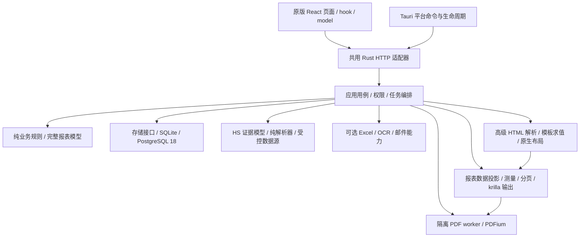

# Rust 对照原版 C#/.NET 10 后端功能差距及修正方案

> 盘点日期：2026-09-20。本文是本次源码对照结果和后续实施清单，不是功能完成声明。原版以相邻只读 `ExportDocManager_CS` 为准；界面、字段含义、业务规则及操作顺序按原版恢复，运行架构遵守 Tauri 2 + React + Rust 的现行约定。用户在本次盘点中进一步确认：**Rust 报表继续采用 krilla + PDFium 联动方案。**

## 1. 对照基线与结论

| 项目 | 本次核对基线 |
| --- | --- |
| Rust 仓库 | `ExportDocManager_RustNative`，提交 `106efd4a5dc2cf2f62399f7b35de0616e159eb7b` |
| 原版仓库 | `../ExportDocManager_CS`，提交 `ba9dbdca72590b06c5f32740e4cd58d3027578da`，分支 `tauri-csharp-net10-backup` |
| 原版技术基线 | C#/.NET 10；`global.json` 最低 SDK `10.0.302`，同代稳定 feature band 滚动；不是本次要求安装或运行 .NET |
| 远端与工作树 | 开始时 Rust 工作树干净；`git fetch origin main` 后 `HEAD` 与 `origin/main` 同为上述 Rust 提交；原版工作树干净 |
| 前端对照 | 对两仓库已跟踪的 `apps/export-doc-web/src` 做内容比较：528/528 个文件统一 CRLF/LF 后相同，无原版独有的缺失源文件；`loginPrefetch.ts` 仅字节换行有差异 |
| 当前运行形态 | 桌面 Tauri + 同一 React + 进程内 Rust HTTP + SQLite；网页/Docker 同一 React + Rust HTTP + PostgreSQL 18 |
| 本次工作范围 | 源码盘点、上游版本查询、缺口与验收方案；没有修改业务实现、依赖、数据库或原版项目，没有重跑完整功能门禁 |

当前问题的重点是：**React 已直接复用原版，但若干 Rust 接口的返回语义、模板解析和输出能力没有与原版对齐。** 生成同名 API、具备 `supports()` 分支、打开空页面，都不能替代业务等价验收。

已确认的优先缺口是：

1. **HS 联网结果语义错误及信息缺失**：搜索混入申报实例/作废编码，规格字段映射不同，详情信息和推荐链没有完整迁移。
2. **报表模型和文件模板链路不完整**：普通行/表格、条件、分页符、分组汇总与高级 HTML 未实现；文件模板维护和实际渲染使用不同的解析入口。
3. **PDFium 已使用，但原生包不是当前发布源最新版本**；尚未使用 `pdfium-render` Rust 封装。更换 PDF 库不能自动补齐报表模板语言或 HTML/CSS 排版。
4. **WebDAV 传输能力缩水**：当前 Rust 只接受 HTTP，并明确拒绝 chunked 响应；原版使用支持 HTTPS 的 `HttpClient`。
5. **部分查询缺少原版的存储侧分页和投影**：模板目录、历史等先加载整类正文，再在应用层筛选/分页，需补齐查询边界。

其余业务已存在较多 Rust 实现和测试，不能笼统写成“全部缺失”；第 5 节逐页列出已有入口与尚未取得等价验收证据的闭环。

状态约定：**缺失**＝源码没有对应能力；**差异**＝已有实现但与原版行为不同；**待验**＝已有代码，尚无本次逐项实跑证据；**方案**＝拟实施选择。优先级 P0 为首先修正的业务阻断/错误语义，P1 为主流程等价，P2 为后续交付与规模验收；这些不是测试通过等级。

## 2. PDFium 的真实用途、版本与选型

### 2.1 当前代码实际使用什么

| 环节 | 当前实现 | 结论 |
| --- | --- | --- |
| 报表数据与排版 | `export-doc-domain::{designer,template}` + `export-doc-report`；先生成分页 SVG | 排版能力由本项目模型和布局器决定 |
| 报表 PDF 编码 | `krilla = 0.8.2`、`krilla-svg = 0.8.1`、`usvg = 0.47.0` | 当前报表生成不是 PDFium |
| 已有 PDF 预览、提取文字、OCR 页图、合并 | `export-doc-engine/src/pdf.rs`、`pdf/native.rs`、`pdf/merge.rs`；通过 `libloading` 手写绑定 PDFium C ABI | 已经在 Rust 后端调用 PDFium；PDFium 本体为 C++ 原生库 |
| 故障与取消隔离 | 当前可执行文件的受控 PDF worker 子进程 | 改换封装时应保留此边界 |
| Rust PDFium 封装 | 已引入 `pdfium-render = 0.9.4`,显式启用 `pdfium_7881 + image_025` | 不能声称已采用该 crate |
| 原生载荷 | `eng/native-runtime-packages.json` 中 Windows/Linux/macOS 包均为 `152.0.7961` | NuGet 仅是原生归档载体，不引入 .NET Runtime |

### 2.2 本次在线查询结果

查询日期为 **2026-09-20**；实施升级时应重新核验，因为“最新”会变化。

| 组件 | 仓库版本 | 本次发布源查询 | 判断 |
| --- | --- | --- | --- |
| `pdfium-render` | 未使用 | crates.io 最新未撤回、无预发布后缀版本 **0.9.4**，2026-09-06 发布，`MIT OR Apache-2.0` | 可评估为现有手写 FFI 的替换封装，尚未安装/验证 |
| `bblanchon.pdfium.win32/linux/macos` | **152.0.7961** | 三个 NuGet 版本索引最新无预发布后缀版本均为 **155.0.8057** | 当前原生载荷落后于该发布源 |
| `bblanchon/pdfium-binaries` | 对应旧构建 | GitHub 最新 release 为 **chromium/8057**，2026-09-14，`prerelease=false` | 是预编译发布项目的版本证据，不等于 Chromium 浏览器稳定通道声明 |
| `krilla` / `krilla-svg` | **0.8.2 / 0.8.1** | crates.io 最新稳定版本同为 **0.8.2 / 0.8.1** | 当前两项已与查询结果一致 |

PDFium 按 Chromium 修订号持续演进，应分别固定“Rust 绑定版本、绑定 API feature、原生库构建、各 RID 归档哈希”。不能把封装 crate 的最新稳定版与底层原生库视为同一个版本，也不能仅凭两个包都叫 latest 就假定 ABI 兼容。

版本与能力来源：[pdfium-render 注册表](https://crates.io/api/v1/crates/pdfium-render)、[封装说明](https://github.com/ajrcarey/pdfium-render)、[Windows 包索引](https://api.nuget.org/v3-flatcontainer/bblanchon.pdfium.win32/index.json)、[Linux 包索引](https://api.nuget.org/v3-flatcontainer/bblanchon.pdfium.linux/index.json)、[macOS 包索引](https://api.nuget.org/v3-flatcontainer/bblanchon.pdfium.macos/index.json)、[8057 发布](https://github.com/bblanchon/pdfium-binaries/releases/tag/chromium/8057)、[krilla 注册表](https://crates.io/api/v1/crates/krilla)、[krilla-svg 注册表](https://crates.io/api/v1/crates/krilla-svg)。

### 2.3 修正方案

**已确认采用 krilla + PDFium 联动：krilla 保留原生 PDF 生成职责，PDFium 负责已有 PDF 的读取、渲染、合并和校验。** `pdfium-render` 能创建/编辑 PDF，但不是 HTML/CSS 排版器，也不解释 Scriban、V3 Grid 或分组表达式；本方案不更换 krilla 的生成职责。长期维护优先建议使用 `pdfium-render` 替换手写 FFI；在版本/功能验收前保留现有实现。三平台调用约定、符号名、回调例外、集中类型宏及迁移条件见[《PDFium 跨平台绑定与验收方案》](./PDFium跨平台绑定与验收方案.md)，不把方案建议写成已完成迁移。

同日补充比较 `pdfium-sys`：crates.io 最新发布仍为 `0.1.1`（2021-03-31），仅声明 Windows 测试，随包声明缺少现有文字提取/合并保存所需的 7 个入口，不作为优先替换方案。若指自建、按固定头文件生成的 sys 层，则是可行备选。绑定方案与设计器交互分层，当前 React 模板预览仍是 HTML/SVG；最终输出预览建议通过 PDFium 渲染 krilla 生成的实际 PDF，完整比较和实现边界见上述方案第 7 节。

PDF 原生能力作为独立内部模块/可选 crate，由 engine 注入调用：

1. 对 `pdfium-render = 0.9.4` 与拟用原生包做 API/符号、字体、文字、图片、合并和取消实验。本次发布归档的 `pdfium_latest` 实际指向 `pdfium_7881`，不能假定与 `8057` 完整兼容；选定并固定 API feature，显式绑定受管绝对路径，不使用系统回退。只有覆盖现有 worker 能力后才替换手写 FFI，不长期保留两套绑定。
2. 原生包 `152.0.7961 → 155.0.8057` 作为独立依赖变更：核验来源、归档签名/哈希、架构、许可原文；同步中央清单、治理记录、notices/SBOM 与打包证据。
3. 包清单当前记录的 `Apache-2.0` 不能代替全部原生 notices 审核。PDFium 上游 [LICENSE](https://pdfium.googlesource.com/pdfium/+/refs/heads/main/LICENSE) 包含 BSD 条款及 Apache 文本；按实际归档携带的许可证和第三方声明逐项记录，不仅检查 Rust 封装的双许可证。
4. 保留 AppRoot 显式注入的库路径、受控 worker、输入/页数/像素/输出上限、超时和退出清理；禁止改成系统目录任意找 DLL 或请求时自动下载。
5. Windows x64 先做真实回归，其余四个平台/架构分别编译与运行；只有本机通过不得写为全平台通过。

**高级 HTML 的方案需单独解决。** 原版链路是 HTML/Scriban 数据绑定 + Chromium 排版；当前已选定 krilla + PDFium，需在其上游补齐模板求值和 HTML/CSS 测量、流布局、分页，再交给 krilla 输出。原 V3 与高级 HTML 可使用不同输入解析器，但共用报表数据、受控资源、布局/输出边界；PDFium 不承担 HTML 解释。先按原版真实模板和测试盘点语法/样式，再验证原生布局可覆盖的范围；完整高级 HTML 保真目前尚未证明，应保留为明确缺口。本方案不直接新增浏览器 PDF 链路；如果某项原版 HTML 能力无法等价实现，需提交具体样本和架构评估，不能静默换成另一模板语言、强制改写为 V3 或输出简表。

## 3. 报表与模板确定缺口

源码依据见第 8 节 E02—E06、E13。原版六份内置模板都有 Rust 对应 `Builtin`，不能写成“内置报表全无”；目前是另写的 Rust 布局，其结果尚不能凭文件名相同认定与原 HTML 等价。

| 编号/级别 | 状态与确定差距 | 受影响操作 | 修正位置与完成条件 |
| --- | --- | --- | --- |
| R01 / P0 | **缺失**：`Kind::Flow.block` 固定为 `DetailTable`，校验只接受 `Invoice.Items`；没有原版 Row、普通 Grid、Conditional、PageBreak 联合类型 | 原版画布可创建结构，Rust 保存/预览却拒绝 | 对照原 V3 契约建立完整类型与纯校验，按结构拆模块；原版结构读取、修改、保存再读取不丢字段；非法结构继续明确报错 |
| R02 / P0 | **缺失**：明细只支持一个可见表、简单列；没有复杂分组、组头/组尾、小计、汇总、旁栏等模型 | 分组报表、复杂装箱明细、带汇总的用户模板 | 在 report 中分离数据投影、分组聚合、测量与分页；分组排序及跨页行为按原版，业务总数和精确金额一致 |
| R03 / P0 | **差异**：文件模板服务可创建/维护 `builtin:` / `user:` 身份，但 `reports::template()` 只解析固定内置路径/两个 `native:` 别名及 `user-template:`；其它引用返回未实现 | 新建文件模板后选择、设默认、预览、发票输出、模板包导入后使用 | 建立唯一模板解析服务，目录、正文、保存、复制、默认项、预览、批量输出共用；按受管根解析文件引用，不能让目录显示成功而输出拒绝 |
| R04 / P0 | **差异**：`reports::catalog()` 从六个 Builtin 和已发布数据库模板构建目录，未读取文件目录元数据，`withSealDefault` 固定 false | 文件模板列表、显示名称、带章默认值、输出默认项 | 合并身份解析和目录查询；原版文件/个人/共享模板的名称、顺序、带章和默认项真实参与单据输出 |
| R05 / P0 | **缺失**：自定义内容必须经 `Design::from_html` 读取 V3 元数据；没有原版 HTML/Scriban 执行链；内置正文虽能返回，但实际由 Rust Builtin 排版 | 高级 HTML 编辑、导入、发布和预览/PDF | 独立模板解析/求值与原生 HTML 布局，统一交给 krilla 生成 PDF、PDFium 预览/校验；覆盖 `data-repeat`、`data-show-if`、`data-field-name/format` 以及实际模板语言用法；保留原稿且不静默改写 |
| R06 / P1 | **差异**：模型存有 `repeatHeaderOnPageBreak` / `keepRowsTogether`，布局当前每页固定画表头、每行整体换页；图层 `keepTogether` / `pinToPageBottom` / `minHeight` 未完整进入布局 | 取消重复表头、贴底页脚、长行、分页控制 | 把打印策略纳入测量和分页，按勾选前后实际页数/位置验证；不能只保存布尔值 |
| R07 / P1 | **差异**：明细分页器无条件追加右下角页码；固定组件另可绘制 PageNumber；换行按 ASCII/非 ASCII 估算宽度 | 模板未配置页码仍出页码、配置后可能重复；中英长文本换行不一致 | 页码完全由模板控制；用字体实际测量/整形支撑布局；验证无页码、单页码、中英文混排、跨页长行 |
| R08 / P1 | **差异/待验**：Dashed 被校验接受，但当前基础边框绘制没有对应虚线参数；普通表格的合并单元格/流布局尚无实现。原版 V3 本就要求 A4，A4 限制不列为迁移缺口 | 画布样式、边框、行列合并与打印输出 | 以原 schema 真正允许的样式建立表；逐属性验证输出，不把“能保存”当成生效；保留 A4 横/纵向原合同 |
| R09 / P1 | **已有、待验**：图片资源上传、归属、发布、历史、共享等代码与测试存在；复杂结构中的图片引用和历史/文件模板回收未证明全面等价 | 受控图片、印章、图片唛头、共享模板、恢复版本 | 共用资源解析器覆盖全部 AST/HTML 引用；检查权限、缺图/坏图、跨公司、历史引用及并发回收；预览与 PDF 使用同一数据投影 |
| R10 / P1 | **已有、待验**：六份内置布局、付款/报销、ZIP/合并/单据包均有实现；原版真实输出对照不足，且受 R01—R05 阻断 | 发票、装箱单、合同、报关单、付款单、费用报销，批量/邮件附件 | 每份模板用同一匿名数据生成 C# 与 Rust 样本，对照字段、金额、唛头、印章、页数、页眉尾、跨页行及打印尺寸；多模板顺序、命名、带章和 ZIP 内容一致 |
| R11 / P0 | **差异**：文件保存/重命名在数据库事务内直接改磁盘，删除先改磁盘再更新数据库；`Store::transaction` 只回滚数据库，没有原版 `ReportTemplateStorageCoordinator` 的文件快照回滚 | 模板/目录/默认项出现中途失败或取消后可能不一致 | 建立共用文件变更协调器，限定受影响文件的快照和最终设置提交；保存/改名/删除/导入复用，故障注入验证磁盘、目录、引用、设置一起恢复，恢复失败可观察 |
| R12 / P1 | **差异**：`catalog::validate_revision` 对正文读取错误使用 `.ok().unwrap_or_default()`，丢失 I/O 原因，通常变为版本冲突 | 无权读取、坏路径或磁盘故障被提示为“别人已修改” | 只把真正的摘要不符归 409；不存在/权限/I/O 按现有契约区分，基础设施失败不得伪装成冲突；保留前端草稿 |

R03/R04/R11 应先于大量排版扩展修复：没有统一身份、目录与文件事务，完善后的模板仍无法从业务页稳定进入正确渲染器或安全保存。

报告模板的“读取原文并保存草稿”“结构校验”“可输出能力检查”要有清晰边界。未支持内容不得被重建为 starter、删去字段或覆盖原稿；合法但未接通的渲染能力给出明确提示。空白新建 starter 已有实现，保留原行为。

## 4. HS 联网查询确定差异与修正方案

### 4.1 已定位的根因

原版不是单纯抓取一个表格：`I5a6HsCodeProvider` 先读取静态页，必要时使用受管浏览器；`I5a6PageParser` 区分标准编码与申报实例，`HsCodeService.Remote` 补充当前编码与推荐链，最后 API 筛选返回标准编码、知识服务保存待审核实例。Rust 目前把这条流程压缩为静态 HTML → `Vec<ApiHsCodeDto>`，遗漏了中间证据模型及部分 API 规则。

| 编号/级别 | 原版行为 | Rust 当前差异 | 修正与最小验收 |
| --- | --- | --- | --- |
| H01 / P0 | `SearchRemoteHsCodes`、`CaptureRemoteHsCodes` 的 `items` 只含 **非作废 StandardCode**；按规范编码去重，优先有实例数和描述的记录；申报实例另计数 | `hs_remote.rs` 直接返回 parser 全部记录，包含 `DeclarationExample` 和 `Obsolete`；`count` 是混合总数，source 也从原版 `remote` 改为 `i5a6` | 恢复 API 语义和计数；同一 HTML 输入返回相同标准编码集合/顺序/字段，案例不混入标准结果 |
| H02 / P0 | 商品规格/案例规格放 `Description`，税则申报要素放 `Elements`；标准品名优先 `.showdesc`，方括号英文放描述 | Rust 将规格列写入 `elements`，`description` 未填；品名单元格全文合并，英文/附注可能混入名称；候选 capture 也从 `elements` 取规格 | 先修解析语义，再修候选映射/指纹；名称、英文说明、案例规格、申报要素独立验证，避免错误去重和污染知识库 |
| H03 / P0 | 依据语义表头、周边标题评分识别标准表与实例表；支持“税则号列、货品名称、货物名称”等以及移动卡片 | Rust 广泛扫描所有 table，以“有规格且无实例数”区分；缺少部分表头别名；卡片兜底被标为 StandardCode，并把文本合在名称中 | 在纯 parser 中移植原版通用规则；覆盖表头换序、说明行、CSS/ID 更换、多个表和移动卡片，不按某个商品写特例 |
| H04 / P0 | 详情 bundle 包含行邮税号、CIQ、分类章节、申报实例和推荐关键词；`FromRemoteDetail` 映射至 API | Rust 补充税率/单位/要素等字段和部分链接推荐，但不解析行邮税号、CIQ、分类及实例，`declarationExampleCount` 等保持默认 | 完整详情证据模型和 DTO 投影；使用原 `ParseDetailPage_ShouldReadAllFieldsReferencesAndTwentyDeclarationExamples` 场景，核对 20 条实例、行邮税号、CIQ/章节与前端展示 |
| H05 / P0 | 搜索追踪作废编码推荐；没有当前标准时可从实例追详情，自动详情预算 12、推荐深度上限 3，循环去重；详情解析含文本推荐 | Rust search 不追推荐；resolve 只对作废详情取前 3 个链接关键词查一次，没有等价递归/预算/当前标准筛选及替代详情补全 | 将 resolver 与 parser/HTTP 分离，移植有界追踪和去重；历史实例保留旧码，推荐只形成证据，不自行认定当前年度有效 |
| H06 / P0 | 普通搜索只读；capture 保存待审核案例/替代证据；resolve-detail 同时捕获详情实例，再返回补全/替代结果 | Rust capture 只遍历搜索案例；resolve-detail 没有提取和捕获详情案例/推荐关系，结果提示改为仅参考未写入 | 对齐三个动作的写入语义；公司隔离、指纹幂等、人工确认保护、取消与事务完整；不得自动写 Active 税则 |
| H07 / P1 | 静态读取含有界重试，静态无结果/失败时受管浏览器取语义 DOM；health 说明静态和浏览器可用情况 | Rust 仅静态请求，20 秒、4 MiB、禁重定向；缺少浏览器路径；交互页返回不可读取错误 | 网络源适配器保留明确超时/取消/容量/URL 限制；按需要注入可选浏览器能力，资源缺失时明确说明；正常空结果、源故障、验证码分别验证，不绕过验证码 |

以上是源码可确定的差异。本次**没有取得用户具体失败关键词、当时源站 HTML 或两程序同一时刻的响应，也没有实跑联网查询**，所以不能把某次线上结果不一致唯一归因于站点动态加载；H01—H06 本身已足以造成相同页面输入下的结果不等价。

### 4.2 模块划分

- `export-doc-hs`：划分 `model`、`parser/search`、`parser/detail`、`parser/recommendation` 和 `transport/i5a6`；parser 只接受 HTML 和观察时间，不访问网络、数据库或 UI。内部区分标准记录、案例、替代证据和详情，API DTO 只在边界转换。
- engine 的 HS 用例：负责查询编排、详情预算/深度、当前有效税则解析和动作权限；`hs_remote`、`hs_learning`、`hs_search` 共享规则，不能再维护彼此不同的规格/去重定义。
- storage：负责候选/示例/替代关系的事务与版本；普通搜索无写入，capture/resolve 的写入按原合同执行。
- React：继续复用 `HsCodeToolsPanel`、`HsCodeKnowledgePage`、`InvoiceHsKnowledgePanel`。前端显示与筛选以正确后端结果为准，不能靠隐藏错误记录掩盖 H01。

### 4.3 对照测试集

使用同一份公开或匿名 HTML 快照供 C# 基线与 Rust 比对，覆盖原版已有测试中的“睡衣、男式/女式 T 恤”等场景以及通用结构变体：

1. 标准表 + 实例表混排；标准条目、实例计数、同码不同规格、英文名分离。
2. 作废码 + 纯文本/链接推荐 + 循环推荐；只有历史实例但能找到当前标准；预算耗尽可观察。
3. 详情 20 条案例、CIQ、行邮税号、分类章节、全部税率字段；改 ID/标题/列序仍保持语义。
4. 搜索不落库，capture/resolve 只写待审核证据；重复调用不重复建例、不覆盖人工确认、不污染其它公司。
5. 前端搜索 → 查看详情 → 候选审核 → 本地知识检索 → 发票明细回填 → 保存发票提交反馈，逐步比较原版行为。
6. 真实源站请求作为独立集成检查记录采样时间、关键词和结果摘要；网络变化不替代确定性的解析回归，源故障不能伪装成成功空列表。

## 5. 按原版逐页补齐的实施台账

下表来自原版共用的 `workspaceNavigationCatalog.ts` / `AppWorkspaceRoutes.tsx`，拆出必要的子页面和流程；不是菜单项计数。Rust 列为 `crates/export-doc-engine/src/engine/` 下模块简称，独立能力另注。**“待验”行先做定向对照，发现不符再修根因，不重新编写已经等价的页面。**

| 页面/入口 | 原版 C# 用例基线 | Rust 已有落点 | 缺口/必须补齐的验收 |
| --- | --- | --- | --- |
| 启动、登录、退出 | 会话、许可证、运行能力、首次初始化 | `accounts`、`auth`、`licensing`、`lifecycle` + server/Tauri | 基础桌面登录已有历史实跑；待验团队初始化、过期/撤权、离线本机访问、退出任务/进程回收 |
| 我的待办 `/worklist` | `IWorklistService` | `worklist` | 待验全部分页、按来源权限过滤、行政/人事事项、点击后正确定位，不能推断未授权财务数据 |
| 单证概览 `/dashboard` | `IDashboardService` | `dashboard` | 待验不同权限/公司范围、业务自然日、金额/数量汇总；历史 NaN 修复不代表全指标等价 |
| 销售概览 `/crm/dashboard` | CRM/商机汇总 | `crm_dashboard`、`supplier_overview` | 待验指标、范围、筛选及进入原对象的操作 |
| 文件任务 `/jobs` | `IBackgroundJobService` | `tasks/*`、`jobs` | 已有持久化、输出、重试；待验重启恢复、取消、重复下载、撤权重试、输出原子发布与清理；报表任务受 R 系列影响 |
| 客户与跟进 `/crm/follow-ups` | `ICrmService`、客户/联系人/跟进 | `crm`、`related_records`、`party_files` | 待验独立对象读取、草稿/浏览器返回、跨页搜索、动作权限、导入预览确认、并发修改 |
| 商机与报价 `/crm/opportunities` | `ISalesOpportunityService` | `sales`、`related_records` | 待验阶段流转、报价明细、精确金额、下一步/跟进、停用及范围隔离 |
| 供应商 `/suppliers` | 目录、联系人、供货关系、评价 | `sales`、`related_records`、`supplier_overview` | 待验同公司关联约束、评分/统计、停用、导入导出、明细权限与并发 |
| 邮件中心 `/tools/email` | `IEmailService`、投递历史 | `email` + `export-doc-mail` | 已有 SMTP/附件策略；待验正文、收件人、任务幂等、结果分页、取消/失败、PDF 附件授权及模板输出 |
| 邮件模板 `/crm/email-templates` | `IEmailTemplateService` | `email_templates` | 待验富文本/高级 HTML、发布/共享/停用/恢复、缺变量、历史、跨公司受众及冲突保稿 |
| 发票列表/编辑 `/invoices` | `IInvoiceService`、核对、交换包 | `records`、`workflows`、`invoice_transfer` + domain | 基础保存已有历史实跑；待验五页签、实际/报关明细、复制、核对/撤销、删除、未保存草稿、键盘/中文 IME/粘贴；HS/PDF 分别依赖 H/R 系列 |
| 发票信用证页签 | 文档导入、提取、合规复核 | `letter_of_credit`、`ai`、`pdf` | 待验 PDF 文字/OCR、文档上限、字段提取、人工修改与 AI 超时/取消/依赖不可用 |
| 发票输出/高级导出 | HTML/PDF、托单、单据包、邮件 | `reports`、`document_packages`、`excel`、`email` | **R01—R10**；另验跨页选择、顺序/命名/带章/合并/ZIP、模板默认值及撤权时输出保护 |
| 统计查询 `/query/invoices` | 查询仓储、`IQueryResultExportService` | `invoice_query`、`records` | 待验筛选、自然日、汇总、排序、导出与查看范围不同的场景；Q01 查询下推 |
| 付款报销 `/payments` | `IPaymentService`、付款报表 | `records`、`workflows`、`reports` | 基础创建已有历史实跑；待验明细/备用字段、收款人快照、自定义方式、并发、预览不写库；付款/报销模板依赖 R 系列 |
| 业务资料 `/business-attachments` | 附件内容、版本、确认和分类 | `attachments`、`attachment_categories` | 待验公司分类、容量/版本、内容预览、有效版本确认、永久删除审计、关联发票删除阻止、原子备份恢复 |
| 单一窗口操作中心 `/single-window/operation-center` | 跟踪、交接、回执、持卡机桥 | `single_window/*` + 独立 crate | 已有流程/协议代码；待验真实持卡机、官方样本、重复回执、失败/重试/取消、办公室与申报站衔接；不得以本地 XML 生成宣称已对接官方 |
| COO/ACD `/single-window/coo`、`/single-window/acd` | 原产地证、代理托单字段映射/修复 | `single_window/documents`、`review`、`imports` | 待验原表单分区、生产商/默认档案、字段锁定、局部清空/修复、草稿/版本、XML 输出与回读 |
| 申报词典 `/single-window/reference-catalog` | 参考目录、别名、Excel 预检 | `single_window/references`、`catalog_excel` | 待验表格编辑、别名、预览/确认、跨公司目录与单据联动 |
| HS 编码知识 `/master-data/hs-knowledge/search` | 税则、案例、反馈、联网证据 | `hs*` + `export-doc-hs` | **H01—H07**；本地年度导入/完整快照、知识包导入冲突和当前可信编码回填另验 |
| 基础资料 `/master-data/*` | 客户、出口商、付款对象、商品、单位、港口等 | `records`、`product_options`、`custom_options`、`media` | 待验目录与详情、超过 200 条时远程选择、停用/删除引用、印章上传、通知人三态、地址银行折叠不丢草稿 |
| 报表模板管理 `/reports/templates/manage` | 文件/个人/共享模板、默认与模板包 | `report_template_files/*`、`report_templates/*` | **R03—R05、R09、R11/R12、Q01**；导入后可使用、设默认后业务页生效、修改/删除并发及回滚 |
| 设计器 `/reports/templates` | 完整 V3、HTML、安全校验/预览 | domain designer + report | **R01—R10**；工具栏、画布、属性、撤销/重做、中文输入、草稿冲突与实际 PDF 一起验 |
| Excel 模板与托单 `/tools/excel` | 原 Excel 模板、识别/字段映射/导出 | `excel` + `export-doc-excel` + 现有 analyzer | 待验原模板格式/公式/合并区域、跨表补充信息、导入预览再提交、托单输出；不复制第二个识别器 |
| 文字识别 `/tools/ocr` | 图片/PDF/OCR 服务 | `ocr`、`pdf` + Rust OCR 工具 | 中文图片已有历史实跑；待验多页/倾斜/坏图、大输入、取消、缺资源及浏览器上传/桌面文件选择的不同权限边界 |
| 装柜模拟 `/tools/container-packing` | `IContainerPackingEngine`、方案与现场 PDF | `packing`、domain packing、report packing | 待验同输入算法约束、优先组、载重/旋转、保存回读、统计、视图与现场 PDF 的货物编号/位置一致 |
| 今日汇率 `/tools/exchange-rates` | `IExchangeRateService` | `exchange` + `export-doc-exchange` | 待验原数据源、买入卖出/单位/日期口径、页面结构改变、超时、错误分类及金额计算 |
| 人员档案 `/office/people` | `IPersonnelService` | `personnel`、`personnel_queries`、`office_events` | 待验入职/误录修正/转正/调岗/离职/返聘、身份证/图片隐私、账号撤销与交接阻止 |
| 公司通讯录 `/office/directory` | 工作资料只读投影 | `personnel_queries` | 待验只展示在职工作信息、头像权限，不泄露身份证及私密档案字段 |
| 会议室 `/office/meeting-rooms` | 申请/审批/登记、钥匙交接 | `office`、`office_queries`、`office_workflows` | 待验 SQLite 代登记与 PostgreSQL 团队申请分支、重叠/容量、修改取消、交接后限制及并发 |
| 物品领用 `/office/supplies` | 库存/预留/审批/发放归还 | 同上 | 待验原子库存、修改释放/重新预留、独立审批、补货和人员调岗/离职阻止 |
| 组织架构 `/system/organization` | `IOrganizationDirectoryService` | `organization` | 待验层级/负责人、停用/删除引用、跨公司限制、保存后重新定位、刷新账号/人员选项 |
| 账号与权限 `/system/access-control` | 用户、方案、有效授权/数据范围 | `accounts`、`auth`、`permission_templates` | 已有权限代码；待验资源×动作×范围、派生依赖、空/停用模板拒绝、团队跨公司、并发、撤权及导航一致 |
| 审计日志 `/audit-logs` | `IAuditLogService`、维护/导出 | `audit`、`audit_values` | 待验脱敏、排序分页、筛选计数、导出范围、保留/清理、独立审计与故障分类 |
| 设置 `/settings` 的常规/业务/邮件/AI 子页 | `ISettingsService` 与各能力配置 | `settings`、`custom_options`、`diagnostics` | 待验每个设置保存后实际生效、敏感值遮掩、只改指定分组、版本冲突、诊断与真实能力一致；报表默认项依赖 R04 |
| 设置中的备份/恢复/云同步/灾备/迁移 | `IBackupService`、共享库维护、WebDAV、灾备、迁移 | `maintenance`、`team_backup/*` | **M01—M03**；SQLite/PostgreSQL 隔离恢复、回滚、锁丢失 fail-closed、凭据/业务角色、HTTPS 云备份与大文件 |
| 关于/授权/更新 `/system/about`、`license`、`update` | 注册、支持包、updater | `licensing`、`diagnostics` + Tauri updater | 待验产品版/离线许可/信任、支持包脱敏、签名升级/失败恢复；不宣称旧 .NET 包可直接升级 Rust |

## 6. 跨页面与工程差距

| 编号/级别 | 状态/证据 | 修正方案与验收 |
| --- | --- | --- |
| M01 / P0 | **缺失**：`team_backup/cloud.rs::parse_url` 只接受 `http://`；`request` 对 chunked 返回不可用。UI 配置相同也无法访问原 HTTPS WebDAV | 删除重复的最小 HTTP 实现，复用受控 Rust HTTP 传输/网络策略，支持 HTTPS、证书校验和标准响应分帧；保留流式 4 GiB 上限、2 MiB 列表/64 KiB 错误边界、超时取消；验证 PROPFIND/PUT/GET、TLS、chunked、重定向策略与断传清理，不要求用户降成 HTTP |
| M02 / P1 | **差异**：`Config::read_parts` 对凭据读取/解密错误使用 `unwrap_or_default`，将损坏凭据变为空密码 | 区分“未配置”与存储/解密失败，失败保持明确错误，禁止继续发起空密码请求；做损坏密文与数据库故障回归 |
| M03 / P1 | **已有、待验**：SQLite、PostgreSQL、灾备、迁移实现已有，不可依据旧日期文档误判为全无 | 原版工作流逐项比对恢复验证、维护锁、失败回滚、会话撤销、自动备份、临时输出清理与团队维护角色；真实 PostgreSQL 18 独立验收 |
| Q01 / P1 | **差异**：模板列表/历史调用 `store.all()`，storage 查询整类 `body`；原版按权限/筛选计数、存储侧分页并投影元数据 | 扩展语义查询接口，storage 内实现过滤/排序/计数/分页/字段投影；先覆盖模板，再盘点发票/HS/目录/投递等同类路径。不得把 SQL 放进 engine；列表禁止读取所有 HTML/历史正文。尚无本次压测数字，不虚报实际耗时 |
| A01 / P1 | **待验**：生成契约包含路由/schema/权限，但无法说明返回业务语义一致，H01 即为反例 | 以原 React 实际请求和 C# 同输入响应做差分；只归一化 ID/观察时间等非业务差异，不过滤缺字段、顺序、金额、状态和错误。保持官方 OpenAPI 为唯一公共契约 |
| A02 / P1 | **方案**：部分 engine 协调器继续承担较大分发/JSON 拼装职责；已有领域/存储分层应继续保留 | 按用例拆 query/command/model/adapter，边界使用生成 DTO 或明确内部类型，避免继续扩张 `mod.rs`/`records.rs`。共享规则只实现一次，不为了每页新增一套协议 |
| U01 / P1 | **待验**：源码一致不等于 Windows WebView、网页和其它 OS 实际交互一致 | 逐页验证原布局、页签、表格编辑/滚动、中文 IME、键盘、返回导航、错误自动展开、折叠会话状态和保稿；复用 hook/model/service，不添加通用 JSON 表单或 LocalStorage 持久化 |
| D01 / P2 | **已有部分载荷、待验**：本地历史交付为 Windows GNU Debug 联调包；四版裁剪、正式 MSVC、其它平台/架构和真实 Docker 尚不能据此宣称完成 | Full 默认 OCR；按产品和 RID 检查真实依赖图、原生资源、字体、模板、notices、安装/启动/卸载/更新；桌面排除 PostgreSQL server 适配/Node/.NET，网页不引入 Tauri |

## 7. 实施顺序与模块边界

### 7.1 批次顺序

| 批次 | 实施内容 | 批次完成条件 |
| --- | --- | --- |
| B0：固化对照 | 固定本文件基线；按原 API/服务测试整理匿名输入、源页面 HTML、模板与输出样本；建立逐页状态记录 | 每个缺口有输入、预期、源码落点；真实客户文件/凭据不进仓库 |
| B1：HS 与直接阻断 | H01—H06，H07 能力边界；M01/M02；PDFium 升级/封装实验单独记录 | HS 同输入字段/类型/候选写入等价；HTTPS 云备份可完成；PDF 版本变化有独立证据 |
| B2：模板入口与 V3 | R03/R04 统一解析、R11/R12 文件事务与错误分类，然后补 R01/R02/R06—R09；Q01 先处理模板目录/历史 | 原画布结构可保存、发布、预览、输出；文件/个人/共享模板及默认项贯通 |
| B3：原版报表保真 | 在 krilla + PDFium 方案上补 R05 原生 HTML 布局，R10 六类输出及单据包/打印/邮件附件集中联调 | 同数据原版/新版逐页对照；不删原稿、不简化、不自动改模板语言；多模板输出闭环；不能覆盖的 HTML 样本继续列为未完成 |
| B4：业务逐页 | 按第 5 节完成单证/资料/工具 → 客户供应链/邮件 → 行政组织/权限的操作闭环 | 每页同时完成界面、用例、存储、权限、并发、失败/取消和输出；已等价部分只记录，不重写 |
| B5：系统与交付 | 设置、维护/恢复、Q01 其它目录、D01 打包与目标环境 | 实库/跨平台/产品版/升级证据完整；未运行环境保留待验 |
| B6：最终集中门禁 | 合并批次后统一执行完整 Rust/Web/实库/治理和所涉平台验收 | 检查无失败；忽略实库测试另跑；当前事实与本台账按真实证据更新 |

开发过程中只做必要编译和真实失败的最小回归，一批完成后集中联调；已经通过且未受影响的检查不重复。当前请求先交付清单与方案，B1 以后均为待实施工作。

### 7.2 目标依赖方向



- Domain 不引用 HTTP、GUI、数据库、路径或进程；报表布局精度与业务十进制计算分别处理。
- 模板仓储/解析入口统一返回已授权的模板身份、版本、正文和资源；渲染器不查询数据库或猜测用户路径。
- 外部 HTTP、浏览器、PDFium、OCR 进程放在明确适配器/worker 内；超时、取消、容量和清理是边界合同，不能散入页面与协调器。
- 桌面与服务端由组合根启用能力。报表使用 krilla + PDFium；HS 如需浏览器获取页面，放在独立可选网络适配器中，不复用桌面界面 WebView 的会话，不把浏览器依赖拉入核心或报表生成器。
- SQL 仅在 storage；增加分页查询接口而非在 engine 拼 SQL。拒绝旧试验库/原 C# 库，不添加猜测式迁移、双读或客户文件名特例。

### 7.3 每页完成的证据要求

每页记录：对照提交、页面/页签、操作步骤、测试数据、API 输入输出、持久化变化、权限身份、生成文件、截图/日志、未完成项。最低包含正常、空、错误、权限不足、并发冲突、取消/超时场景；按页面实际风险选取，不为无关页面复制无意义测试。

报表比较不能只看 `%PDF-` 文件头；至少核对文字、金额/数量、图片、页数、纸张/坐标、跨页、打印和可搜索文字。HS 比较不能只看返回 200 或条数；核对每个字段、记录种类、推荐链及数据库副作用。

最终 Rust 检查至少：

```powershell
cargo fmt --all --check
cargo test --locked --workspace
cargo check --locked --workspace --all-features
pwsh -NoProfile -File scripts/test-native-postgres.ps1 -PostgresBin <隔离PostgreSQL18工具目录>
npm --prefix apps/export-doc-web run build
node scripts/generate-dependency-governance.mjs artifacts/dependency-governance --release --verify-repository
git diff --check
```

再执行受影响的 React 操作/无障碍/视觉/缩放、真实 Tauri、脚本/工作流/公开源码、资源/打包检查。治理结果须 `unresolved=0 / disallowed=0`。Firefox/WebKit 只走手动工作流；Docker、ARM64、Linux/macOS 真机及正式升级各自记录，不沿用原 .NET 的通过数字。只有修改 C# 对照实现才执行相应 .NET 门禁；Rust 交付不恢复 .NET/NPOI 运行依赖。

## 8. 主要源码证据索引

下列相对链接均以本文所在 `docs/` 为起点。C# 链接指向相邻只读原版；完整可移植定位为第 1 节的仓库/提交加对应仓库内路径。

| 编号 | 原版 C# 基线 | Rust/共用前端落点 |
| --- | --- | --- |
| E01：导航/前端 | [原版导航](../../ExportDocManager_CS/apps/export-doc-web/src/app/workspaceNavigationCatalog.ts) | [导航](../apps/export-doc-web/src/app/workspaceNavigationCatalog.ts)、[路由](../apps/export-doc-web/src/app/AppWorkspaceRoutes.tsx) |
| E02：模板模型 | [V3 合同](../../ExportDocManager_CS/src/ExportDocManager.Application/Services/Reporting/ReportTemplateV3ContractCatalog.cs)、[schema 校验](../../ExportDocManager_CS/src/ExportDocManager.Infrastructure/Services/Reporting/ReportTemplateV3SchemaValidator.cs) | [designer](../crates/export-doc-domain/src/designer.rs)、[template 校验](../crates/export-doc-domain/src/template.rs) |
| E03：HTML/PDF | [Scriban 渲染](../../ExportDocManager_CS/src/ExportDocManager.Infrastructure/Services/Reporting/ScribanReportTemplateRenderer.cs)、[报表 PDF 服务](../../ExportDocManager_CS/src/ExportDocManager.Infrastructure/Services/Reporting/ReportPdfRenderService.cs) | [布局](../crates/export-doc-report/src/layout.rs)、[PDF 编码](../crates/export-doc-report/src/document.rs)、[Builtin](../crates/export-doc-report/src/builtin/mod.rs) |
| E04：模板解析/目录 | [模板目录加载](../../ExportDocManager_CS/src/ExportDocManager.Infrastructure/Services/Reporting/ReportTemplateCatalogLoader.cs)、[路径解析](../../ExportDocManager_CS/src/ExportDocManager.Infrastructure/Services/Reporting/ReportTemplatePathResolver.cs) | [报表用例](../crates/export-doc-engine/src/engine/reports.rs)、[文件模板](../crates/export-doc-engine/src/engine/report_template_files.rs)、[文件目录](../crates/export-doc-engine/src/engine/report_template_files/catalog.rs) |
| E05：模板分页 | [目录/历史查询](../../ExportDocManager_CS/src/ExportDocManager.Infrastructure/Services/Reporting/UserReportTemplateService.Queries.cs) | [模板用例](../crates/export-doc-engine/src/engine/report_templates.rs)、[SQLite](../crates/export-doc-storage/src/sqlite.rs)、[PostgreSQL](../crates/export-doc-storage/src/postgres.rs) |
| E06：资源与现有测试 | [资源权限](../../ExportDocManager_CS/src/ExportDocManager.Infrastructure/Services/Reporting/ReportTemplateImageResourceAccessService.cs) | [资源用例](../crates/export-doc-engine/src/engine/report_assets.rs)、[现有报表闭环测试](../crates/export-doc-engine/tests/report_workflow.rs)、[现有内置测试](../crates/export-doc-report/tests/builtins.rs) |
| E07：HS 传输/解析 | [Provider](../../ExportDocManager_CS/src/ExportDocManager.Infrastructure.Browser/Services/MasterData/I5a6HsCodeProvider.cs)、[Parser](../../ExportDocManager_CS/src/ExportDocManager.Infrastructure.Browser/Services/MasterData/I5a6PageParser.cs) | [HS 传输](../crates/export-doc-hs/src/lib.rs)、[HS parser](../crates/export-doc-hs/src/parser.rs) |
| E08：HS API | [联网端点](../../ExportDocManager_CS/src/ExportDocManager.Api/Hosting/ApiMasterDataHsCodeRemoteEndpointRouteBuilderExtensions.cs)、[详情编排](../../ExportDocManager_CS/src/ExportDocManager.Api/Hosting/ApiMasterDataHsCodeEndpointHelpers.cs)、[DTO 映射](../../ExportDocManager_CS/src/ExportDocManager.Api/Hosting/ApiMasterDataHsCodeDtoFactory.cs) | [HS 联网用例](../crates/export-doc-engine/src/engine/hs_remote.rs)、[原版复用页面](../apps/export-doc-web/src/features/master-data/HsCodeToolsPanel.tsx) |
| E09：HS 追踪/证据 | [远端服务](../../ExportDocManager_CS/src/ExportDocManager.Infrastructure/Services/MasterData/HsCodeService.Remote.cs)、[知识证据](../../ExportDocManager_CS/src/ExportDocManager.Infrastructure/Services/MasterData/HsCodeKnowledgeService.Remote.cs)、[解析回归样本](../../ExportDocManager_CS/tests/ExportDocManager.Infrastructure.Tests/HsCodeRemoteSearchParserTests.cs) | [知识学习](../crates/export-doc-engine/src/engine/hs_learning.rs)、[知识搜索](../crates/export-doc-engine/src/engine/hs_search.rs)、[本地工具测试](../crates/export-doc-engine/tests/tools_service.rs) |
| E10：PDFium | [PDFium 上游](https://pdfium.googlesource.com/pdfium/) | [worker](../crates/export-doc-engine/src/pdf.rs)、[手写绑定](../crates/export-doc-engine/src/pdf/native.rs)、[合并](../crates/export-doc-engine/src/pdf/merge.rs)、[原生版本清单](../eng/native-runtime-packages.json) |
| E11：WebDAV | [原版传输](../../ExportDocManager_CS/src/ExportDocManager.Infrastructure/Services/WebDavCloudSyncService.cs) | [Rust 云备份](../crates/export-doc-engine/src/engine/team_backup/cloud.rs)、[网络策略](../crates/export-doc-network/src/lib.rs) |
| E12：能力/交付 | [原版应用用例目录](../../ExportDocManager_CS/src/ExportDocManager.Application/Services) | [能力分发](../crates/export-doc-engine/src/engine/capabilities.rs)、[server 依赖](../apps/export-doc-server/Cargo.toml)、[桌面依赖](../apps/export-doc-tauri/src-tauri/Cargo.toml)、[公开脚本说明](../scripts/README.md) |
| E13：文件事务 | [原版协调器](../../ExportDocManager_CS/src/ExportDocManager.Infrastructure/Services/Reporting/ReportTemplateStorageCoordinator.cs) | [文件变更](../crates/export-doc-engine/src/engine/report_template_files.rs)、[版本检查](../crates/export-doc-engine/src/engine/report_template_files/catalog.rs)、[数据库事务](../crates/export-doc-engine/src/engine/store.rs) |

当前实现总事实继续以[《当前架构事实》](./当前架构事实.md)为准；逐批完成情况写入[《程序改进重构进度文档》](./程序改进重构进度文档.md)，并同步[《Rust 原生功能迁移核对表》](./Rust原生功能迁移核对表.md)。本次盘点没有新功能通过记录；表中“待验”不得在没有操作证据时改为“完成”。
