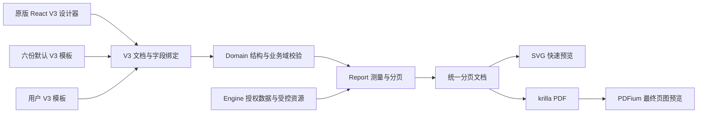

# Rust 统一 V3 模板与原版 PDF 验收方案

> 决策日期：2026-09-21。用户明确选择轻量原生路线：原版 React 设计器 + 统一 V3 模板模型 + Rust 排版 + krilla PDF + PDFium 最终预览。默认 HTML 模板逐项转为可编辑 V3；未支持的高级 HTML 明确拒绝。本文是目标、源码差距及验收要求，不表示六份默认模板已经完成转换。

## 1. 是否能保留原来的单据样式

可以。V3 是描述纸张、表格、文字、图片、字段与分页规则的结构化文档，不限定为某一种简化表格。用户提供的发票、合同、报关单、付款单、报销单均为静态单据版式，可以通过原生向量排版重建；这些视觉效果本身不需要浏览器运行时。

但现有 V3 schema 和 Rust 布局实现尚不完整，不能把“能生成 PDF”写成“已经保留全部版式”。默认 HTML 不能只加一段 V3 标记就宣称完成转换，也不能由文件名选择另一份硬编码票面来冒充统一模板。转换后的每个文字、表格、字段和印章必须能在同一设计器中修改，保存后预览与正式输出使用修改后的同一模型。

目标保真范围包括纸张方向、主要边框坐标、字段含义、列宽/行高、对齐、换行、唛头、图片、印章、日期/金额格式、页数与分页、签字区位置。按用户 2026-09-21 补充要求，字体统一使用现有随包三份 Noto CJK 字体；保留黑体/宋体风格及标题层次，不要求复刻参考 PDF 的原字体。换用批准字体后重新测量与校准布局，字体栅格化的细微差异与版式/数据错误分别评估。

## 2. 本次五份 PDF 样本检查

已用 Poppler 渲染并逐页检查共七页。原始文件位于用户桌面，未修改；页图只保存于忽略的 `.codex-runtime/report-reference-review/`。客户名称、地址、印章和原 PDF 不进入源码仓库。以下只记录通用版式。

| 样本 | 实际纸张与页数 | 必须保留的结构 | 当前仍需重点补齐/验证 |
| --- | --- | --- | --- |
| `invoice.pdf` | A4 竖向，3 页，36 条明细 | 重复公司/客户信息与表头；唛头、复合商品描述、金额三栏；每页 12 行；首张唛头；末页总计；页码 | 每页行数与高度双约束、首/续/末页规则、复合单元格内部对齐、原版边距差异；第 3 页有坏图框，目标应修复，不复制坏图 |
| `contract_template_2024AA001.pdf` | A4 竖向，1 页 | 买卖双方、四栏明细、数量/金额合计、双语条款、签字和透明印章 | 明细之后的连续流布局、长条款跨页、签字/印章与正文的避让；单页样本不能证明多页合同通过 |
| `customs_declaration_template_2024AA001.pdf` | A4 横向，1 页 | 密集多行合并表头、不同列宽、每项上下两行内容、声明/签章区与下方补充说明 | 通用合并网格、宋体风格字体、首/续页不同结构、编号连续；原 HTML 首 6 项、续页每 15 项，须另用超限样本验收 |
| `付款单.pdf` | A4 竖向，1 页 | “用款事项”和“付款联”竖排、跨行/跨列合并、付款方式勾选、收款银行信息、金额大小写、底部签字 | 单元格内嵌排版、文字竖排及对齐、勾选框矢量绘制、长备注与签字区；空数据样本须追加真实匿名长字段 |
| `报销单.pdf` | A4 竖向，1 页 | 斜线表头、八项费用列、附件行、跨列备注、大小写金额与签字 | 斜线单元格及两侧文字、固定行高与长备注增长、字体粗细、签字区跟随 |

装箱单没有本次用户 PDF 样本，仍以相邻只读项目的 `Templates/Export/packing_list_template.html` 为基线，另生成匿名样本验证，不能写为本次已核验。

样本中的 Microsoft YaHei、思源字体名称及其它字重只作为历史观察，不再作为迁移依赖或验收要求。全部默认模板使用 [font-manifest.json](../Resources/Fonts/OpenSource/font-manifest.json) 中已有的三份字体文件（两个家族）：

| 随包文件 | 字体/字重 | 模板用途 |
| --- | --- | --- |
| `NotoSansCJKsc-Regular.otf` | Noto Sans CJK SC，400 | 发票、装箱单、合同正文和表格；V3 新建草稿默认 |
| `NotoSansCJKsc-Bold.otf` | Noto Sans CJK SC，700 | 标题、表头、重点金额及需要加粗的字段 |
| `NotoSerifCJKsc-Regular.otf` | Noto Serif CJK SC，400 | 报关单、付款单、报销单的宋体风格正文 |

三份均为 **SIL Open Font License 1.1**，允许免费商业使用、随应用分发和嵌入 PDF；随包保留许可原文。没有宋体粗体文件，需要加粗时使用已有黑体粗体，不增加第四份字体或依赖系统伪粗体。模板、最终预览和 PDF 的测量/字形应使用同一批随包资源；不为追求与旧字体逐像素一致而引入新字体。当前默认 HTML 字体及新建/异常回退字体已统一，完整 V3 迁移与最终 PDF 版式仍按本方案逐项验收。

## 3. 一个设计器、一个布局后端

- React：编辑、交互、草稿、撤销、字段目录；编辑画布是即时反馈，最终分页以 Rust 输出为准。
- Domain：V3 类型、字段域、尺寸/资源/表格占位校验，无 UI、HTTP、文件系统或数据库。
- `export-doc-report`：受控字段格式化、字体测量、流/固定布局、分页及 SVG/PDF 编码；模板差异以数据表达，不按客户名、文件名或报表名添加布局分支。
- Engine：模板身份、版本、发布、共享/权限、数据投影、资源授权、任务及取消；不解释 CSS、不拼 SQL、不绘制票面。
- PDFium worker：读取真实 PDF 页图、提取、合并与校验；它不是 HTML/Scriban/CSS 排版器。

V3 元数据即唯一设计源。沿用现有 HTML 容器/API 可以作为运输格式，但正文必须由 V3 导出，不能同时维护可独立编辑且可能冲突的 HTML 与 JSON。公共 API 继续来自现有官方 OpenAPI，不手写第二套 endpoint/schema。

## 4. 转换前需要补齐的通用能力

| 能力 | 2026-09-21 源码状态 | 完成条件 |
| --- | --- | --- |
| 基础文字/字段/图片/线条与 A4 横竖向 | 已有 | 所有合法样式真实进入布局，字体缺失明确反馈 |
| 普通网格合并与样式 | 本批修复占位、行列跨度、默认/单格字号粗体对齐、垂直对齐、边框四边/虚线、标签/回退文本、基础竖排;前端保存/导出与 Rust 排版共用越界、重叠和跨行覆盖空行规则 | 对照付款/报销/报关样本，进一步完成溢出测量、垂直对齐、共享边与嵌套布局 |
| 条件/隐藏/禁用输出 | 本批修复 Flow 的隐藏/禁用以及条件样式/回退 | 输出必须与设计器开关一致，失败保留草稿 |
| 明细分组/小计/总计/侧栏 | 已有基础实现；本批修复 SVG 将表格宽度误作纸张宽度 | 组合字段格式化、首/续页侧栏、分组整体保持、重复表头和总计位置 |
| 每页 12 行、首 6 续 15 行 | 原版专用 Builtin 有对应逻辑；统一 V3 已提供通用 `firstPageRows` / `continuationPageRows`,由设计器、Domain 校验与 Rust SVG/PDF 共用,不再按模板名分支;六份模板仍需逐份配置和验收 | 设计器/模型/验证/布局一起提供受控通用分页规则，不能只在 Rust 按模板名分支 |
| 普通 Flow 顺序与分页符 | 2026-09-21 已补 SVG/PDF 的主体普通 Flow 顺序、显式 `PageBreak` 起新页、接近页脚自动换页;明细表复合分页仍单独处理 | 用发票 0/1/12/13/24/36 行及报关首 6/续 15 行真实数据继续验证复杂块测量、页眉页脚边界和明细表与普通 Flow 混排;不能把导出 HTML 有分页标记当作全部 PDF 已分页 |
| 斜线表头 | 普通线条已有，合并网格中可编辑的斜线表头未完整接通 | 通用单元格斜线/角部文字语义，前后端同一结构 |
| 文字测量与字体 | 默认字体采用随包三文件；Rust SVG/PDF 已用 rustybuzz 和同一批字体测量换行,浏览器最终一致性仍待逐页验收 | 只用这三份批准字体真实测量/整形，中文、英文、数字和粗体共同参与换行与行高；不要求匹配样本原字体 |
| 默认模板可视化 | 仍为经典 HTML 原稿 + 六个原生 Builtin 布局 | 六份真实 V3 资产，复制/编辑/保存/发布/预览/PDF 全程同一结构，无暗中回到 Builtin |

当前六份默认模板尚未切换，因此不能声称用户提供的 PDF 已经由统一 V3 重新生成。先实现上述通用能力，再逐份迁移，避免转换过程丢掉原字段或改变单据含义。

## 5. 六份模板逐项迁移顺序

1. 付款单：固定网格、跨行合并、竖排、勾选、大小写金额、长备注和签字。
2. 报销单：共用固定网格，新增斜线表头，验证八费用列/附件/备注/合计。
3. 商业发票：复合明细、唛头侧栏、12 行分页、首/续/末页与印章。
4. 装箱单：复用商业表头、数量/箱数单位分别汇总、重量/体积精度与唛头。
5. 合同：明细后连续条款、长文跨页、签字与印章整体布局。
6. 报关单：复用通用网格和明细分页，首/续页结构、连续编号及声明区。

每份转换保留原 HTML 只读对照与可回滚版本；先生成待验 V3，完成匿名数据与实际页面闭环后才切换其默认选择。未通过的模板仍明确记录状态，不将全部默认模板替换成一个通用 starter，不自动覆盖用户高级 HTML。

## 6. 验收与逐页衔接

- 同一匿名业务输入，先核对所有字段、数量/金额精度、日期、单位、合计和受控资源；不因字体调整更改业务内容。
- 样本逐页比对：纸张方向、页数、表格/主要锚点坐标、页眉/页尾、行列合并、印章与边框、分页连续性。发票覆盖 0/1/12/13/24/36 行，报关覆盖 0/1/6/7/21/22/37 行；另加超长中文/英文及混合单位。
- 设计器移动/改字/合并/字号/边框/禁用后保存，重开并从发票/付款业务页生成 PDF；导出、打印、批量 ZIP、邮件附件、文件/个人/共享模板必须共用结果。
- 资源缺失、越界、权限不足、并发、取消和失败不能产出伪成功文件。原样本中的坏图框不作为通过基线。
- 本机 Windows 的检查与其它平台验收分开记录；浏览器画布截图、单元测试、原 C# PDF 不互相替代。

完整业务页面、权限和操作流程仍按[逐页台账](./Rust与CSharp后端功能差距及修正方案.md#5-按原版逐页补齐的实施台账)推进。当前优先完成 HS 与报表实际差异，集中联调后再跑最终门禁；其余页面不能因前端复用或路由齐全被批量标记完成。

## 7. 高级 HTML 的明确边界

不引入任意 HTML/CSS/Scriban/JavaScript 原生解释器，也不宣称 krilla/PDFium 能直接执行旧 HTML。保留原稿、允许受控存储/导出和查看不等于允许发布/正式渲染；各操作的能力检查必须独立明确。缺少 V3 或使用未支持结构时明确指出原因，转换为 V3 必须保留字段和布局并经过验收。今后若用户要求任意 HTML 完整保真，再单独评估可选浏览器适配器，不改变当前默认轻量方案。
